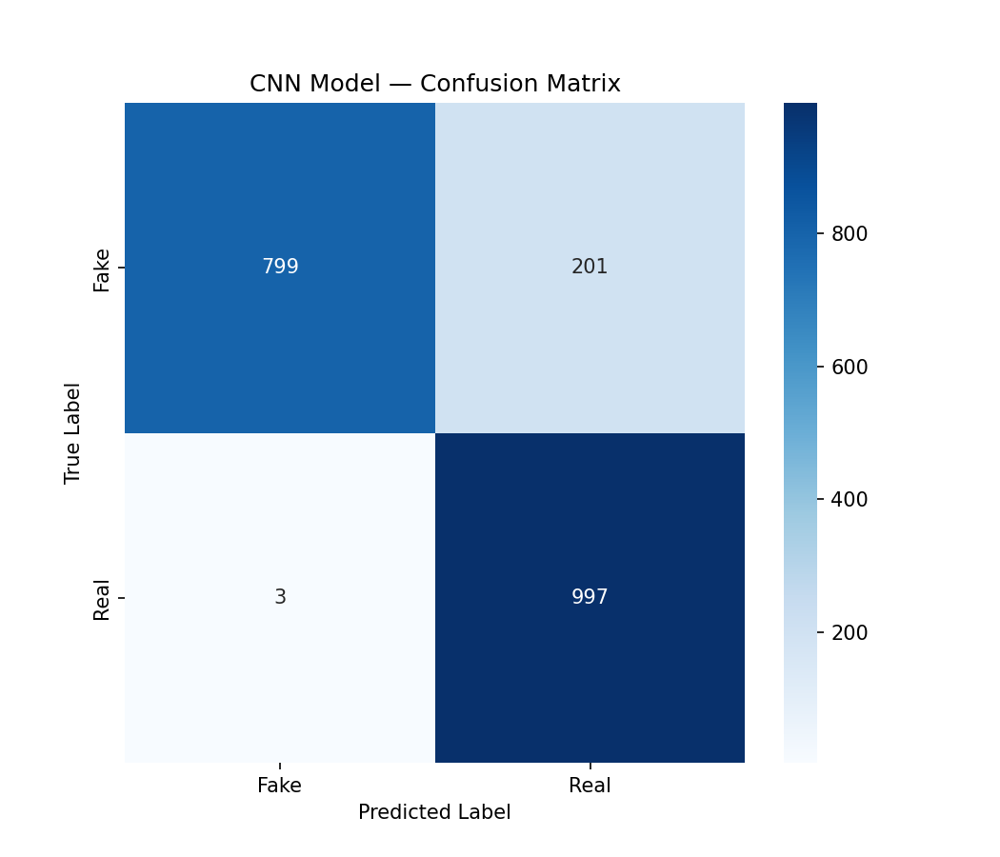
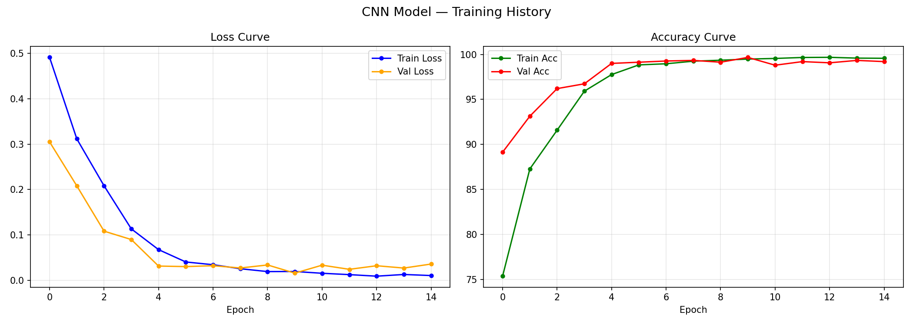
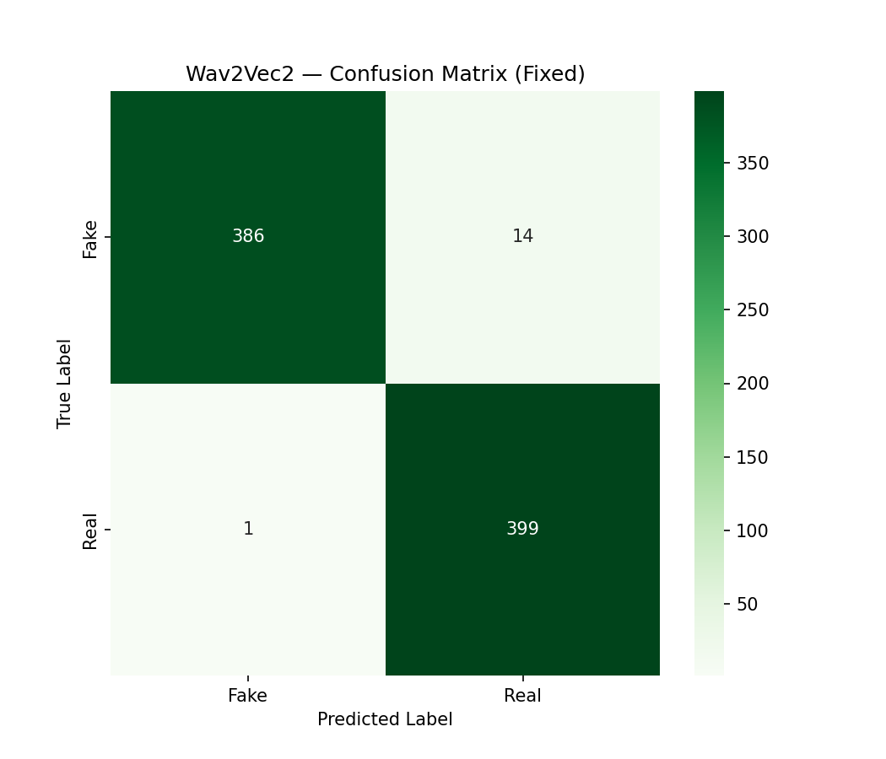
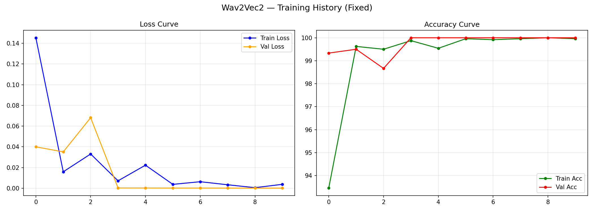

# 🎙️ AI Voice Deepfake Detector

An end-to-end **AI-generated voice detection system** that classifies audio as **Real (bonafide)** or **Fake (AI-generated / spoofed)** using two deep learning approaches — a custom **CNN on Mel-Spectrograms** and a fine-tuned **Wav2Vec2 Transformer** — served through an interactive **Streamlit web app**.

Trained and evaluated on the **ASVspoof 2019 LA (Logical Access)** dataset.

---

## 🚀 Features

- 🧠 **Two independent detection models**:
  - **CNN** — fast, lightweight, trained on Mel-Spectrogram features
  - **Wav2Vec2** — transformer-based, higher accuracy, fine-tuned end-to-end
- 🔄 **Compare Mode** — run both models on the same clip side-by-side
- 🎧 Upload `.wav`, `.mp3`, `.flac`, or `.ogg` audio files
- 📊 Live waveform & Mel-Spectrogram visualization
- 📈 Confidence scores with Real/Fake probability breakdown
- 🖥️ Clean, dark-themed Streamlit UI

---

## 🧩 Architecture

### 1️⃣ CNN Model (`train_cnn.py`)
- Input: 128×128 Mel-Spectrogram (4-second audio, 16kHz)
- 4 convolutional blocks (32 → 64 → 128 → 256 channels) with BatchNorm, ReLU, MaxPool & Dropout
- Fully connected classifier head → 2 classes (Real / Fake)

### 2️⃣ Wav2Vec2 Model (`train_wav2vec2.py`)
- Backbone: `facebook/wav2vec2-base` (pretrained, CNN feature extractor frozen, transformer layers fine-tuned)
- Mean-pooled hidden states → deep MLP classifier head (768 → 512 → 128 → 2) with LayerNorm, GELU & Dropout
- Trained with gradient accumulation and a `WeightedRandomSampler` for class balance

---

## 📊 Results

| Model | Test Accuracy | Notes |
|---|---|---|
| **CNN** | ~89–90% | Fast inference, slightly more false positives on fake clips |
| **Wav2Vec2** | ~98% | Higher accuracy, better generalization, slower inference |

**CNN Confusion Matrix** & **Training Curves**




**Wav2Vec2 Confusion Matrix** & **Training Curves**




---

## 📂 Project Structure

```
ai-voice-deepfake-detector/
├── app.py                      # Streamlit web application
├── train_cnn.py                 # CNN training script
├── train_wav2vec2.py            # Wav2Vec2 training script
├── utils.py                     # Dataset loaders, model defs, preprocessing
├── requirements.txt              # Python dependencies
├── models/
│   ├── cnn_best_model.pth
│   └── wav2vec2_best_model.pth
├── cnn_confusion_matrix.png
├── cnn_training_curves.png
├── wav2vec2_confusion_matrix.png
├── wav2vec2_training_curves.png
└── README.md
```

---

## ⚙️ Installation

```bash
git clone https://github.com/h4ssan5a5-code/ai-voice-deepfake-detector.git
cd ai-voice-deepfake-detector
pip install -r requirements.txt
```

## ▶️ Usage

### 1. Train the models (optional — pretrained weights included)
```bash
python train_cnn.py
python train_wav2vec2.py
```

### 2. Run the web app
```bash
streamlit run app.py
```

Then open the local URL shown in your terminal, upload an audio clip, choose a model (CNN / Wav2Vec2 / Both), and click **Analyze Now**.

---

## 🗂️ Dataset

- **[ASVspoof 2019 LA (Logical Access)](https://www.asvspoof.org/index2019.html)** — a benchmark dataset for audio spoofing/deepfake detection, containing bonafide (real) and spoofed (synthetic/converted) speech samples.

---

## 🛠️ Tech Stack

`Python` · `PyTorch` · `HuggingFace Transformers (Wav2Vec2)` · `Librosa` · `Streamlit` · `Scikit-learn` · `Matplotlib` / `Seaborn`

---

## 👤 Author

**Muhammad Hassan Tariq**
BS Artificial Intelligence — University of Faisalabad
Backend Developer & Freelancer

- 🔗 LinkedIn: [linkedin.com/in/hassan-tariq-21844b401](https://www.linkedin.com/in/hassan-tariq-21844b401/)
- 💻 GitHub: [github.com/h4ssan5a5-code](https://github.com/h4ssan5a5-code)
- 🌐 Portfolio: [hassantariqportfolio.vercel.app](https://hassantariqportfolio.vercel.app)

> Made with ❤️ by Muhammad Hassan Tariq

---

## 📄 License

This project is open-source. Feel free to use it for learning or research purposes — attribution appreciated.
